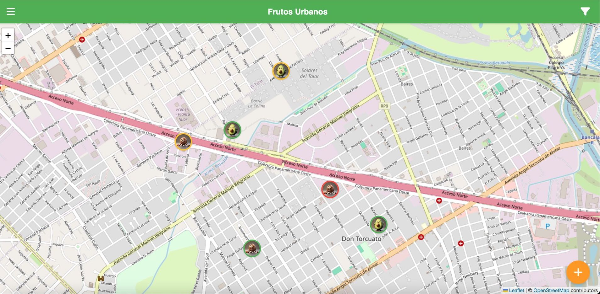
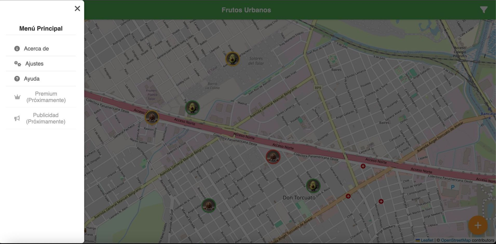
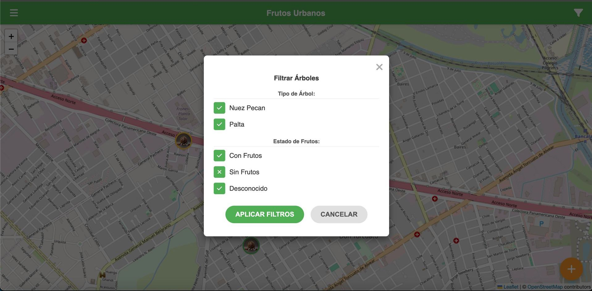

# 🌲 Frutos Urbanos: Un Mapa Comunitario para Conectar Personas y Naturaleza 🥑

## La Oportunidad en Nuestras Calles

En muchas ciudades, valiosos árboles frutales crecen en espacios públicos, parques o incluso en veredas. Sin embargo, a menudo pasan desapercibidos, y sus frutos se pierden sin que la comunidad pueda aprovecharlos. Existe una gran oportunidad para conectar a las personas con estos recursos naturales cercanos, fomentar la interacción comunitaria y promover la sostenibilidad local.

## Nuestra Solución: Frutos Urbanos

Frutos Urbanos es una iniciativa que propone una **aplicación móvil sencilla e intuitiva** que transforma la forma en que interactuamos con los árboles frutales en nuestro entorno. Creamos un **mapa dinámico y colaborativo** donde cualquier persona puede:

1.  **Descubrir** árboles de nueces pecan y paltas cercanos.
2.  Saber **si tienen frutos disponibles** en ese momento, gracias a los reportes de otros usuarios.
3.  **Contribuir** añadiendo nuevos árboles que encuentren.
4.  **Actualizar el estado** de los árboles existentes para mantener el mapa vivo y útil para todos.

Este proyecto inicia su demostración en la comunidad de **General Pacheco, Partido de Tigre, Buenos Aires**, con un modelo diseñado para ser replicable y escalable a otras áreas.

## Vea Nuestro Prototipo en Acción

Hemos desarrollado un **prototipo funcional** que demuestra el concepto principal y las interacciones clave de la aplicación. Este prototipo es una prueba de concepto que muestra cómo los usuarios pueden interactuar con el mapa y la información de los árboles.

### Lo que puedes probar en el Prototipo:

*   **Explorar el Mapa:** Navega por un mapa simulado de General Pacheco y ve los marcadores que representan los árboles catalogados.
*   **Ver Información del Árbol:** Toca un marcador para ver detalles rápidos sobre el árbol y su estado de frutos más reciente.
*   **Reportar si Tiene Frutos:** Simula el proceso de indicar si un árbol visitado tiene frutos disponibles actualmente.
*   **Añadir un Nuevo Árbol:** Prueba el flujo para marcar la ubicación de un árbol no listado y especificar su tipo.
*   **Filtrar Visualmente:** Utiliza las opciones para mostrar solo ciertos tipos de árboles o aquellos que han sido reportados con frutos.

### Accede al Prototipo Aquí:

Puedes interactuar con el prototipo directamente en tu navegador web. Simplemente visita la siguiente dirección:

`https://adrianpizzurno.github.io/frutosurbanos/`

## Nuestra Visión a Futuro

El prototipo actual es solo la semilla de lo que Frutos Urbanos puede llegar a ser. Con la financiación adecuada, planeamos expandir y mejorar la aplicación significativamente:

*   **Crecimiento y Expansión:** Llevar el mapa y la comunidad a más barrios y ciudades.
*   **Funcionalidades Avanzadas:**
    *   Perfiles de usuario para rastrear contribuciones.
    *   Notificaciones personalizadas sobre árboles cercanos con frutos.
    *   Integración de fotos y más detalles sobre cada árbol (especie específica, tamaño, notas).
    *   Historial de reportes para ver patrones de fructificación.
    *   Sistema de valoración o confianza en los reportes.
*   **Sostenibilidad del Proyecto:** Implementar un modelo que permita el crecimiento y mantenimiento a largo plazo, como funcionalidades Premium exclusivas para usuarios suscriptos y oportunidades de publicidad para negocios locales relevantes (viveros, tiendas saludables, etc.).
*   **Impacto Comunitario:** Convertir Frutos Urbanos en una herramienta esencial para la educación ambiental local, la seguridad alimentaria comunitaria y la construcción de barrios más verdes y conectados.

## ¿Por Qué Invertir en Frutos Urbanos?

Frutos Urbanos no es solo una aplicación; es una **plataforma con potencial de impacto social y ambiental real**, que capitaliza el interés creciente en la vida local, la sostenibilidad y la tecnología cívica. Ofrece una oportunidad única para asociarse con un proyecto que:

*   Fomenta la **participación activa de la comunidad**.
*   Promueve el **uso sostenible de los recursos urbanos**.
*   Genera **datos valiosos** sobre el arbolado urbano.
*   Tiene un camino claro hacia la **escalabilidad y la sostenibilidad financiera**.

## Capturas de Pantalla

*El mapa interactivo mostrando árboles en General Pacheco.*

*Visualización de detalles del árbol y el proceso para reportar su estado.*

*Demostración del flujo para añadir un nuevo árbol al mapa.*

screenshots/protipo4.jpg

screenshots/protipo05.jpg

## ¡Hablemos!

Estamos buscando socios e inversores para hacer de Frutos Urbanos una realidad a gran escala. Si comparte nuestra visión de conectar a las personas con la naturaleza urbana y ve el potencial de esta plataforma, nos encantaría conversar.

Por favor, contacte con:

**Adrian Pizzurno**

Correo Electrónico: **adrianpizzurnoprensa@gmail.com**
